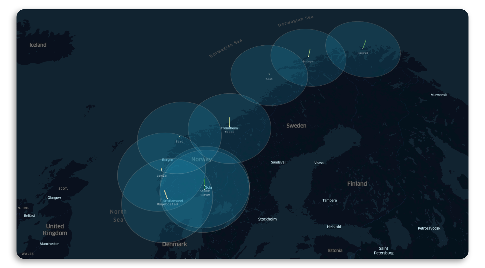

import Bleed from 'nextra-theme-docs/bleed'

# RAYD.R Engine

The **RAYD-R Engine** is an Open Source repository for pysical and virtual meteorological infrastructure. 
Through collaboration with people, universities and orginizations, we plan on building and maintaining a core global resource designed for the future.

It supports Markdown and React components ([MDX](/mdx)), automatically generated [sidebar and anchor links](/docs/anchors), file-system based routing, built-in syntax highlighting, image optimization, custom layouts, i18n, and all the features you love about Next.js.

This is what the data models could llok like:

<Bleed></Bleed>
